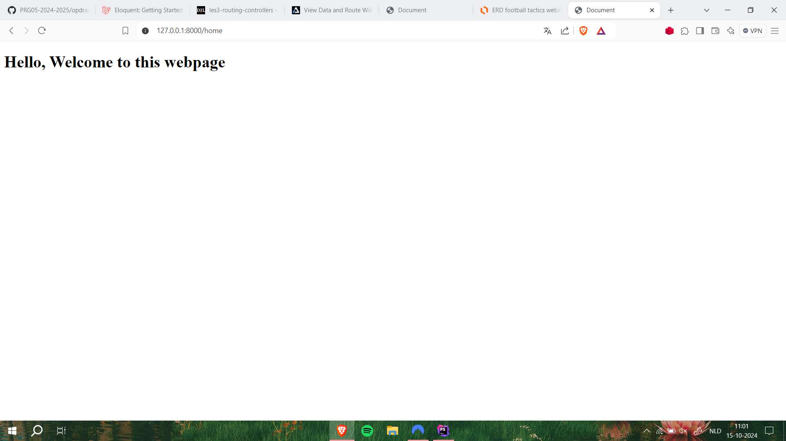

# Changlog
**9-10:**

initail setup van het project.

[naam van link] (www.google.com)

**14-10**

layout toegevoegd
nieuwe pagina toegevoegd

**15-10**

database toegevoegd
model aangemaakt voor de tactics
read toegevoegd van de CRUD met een resource controller

**16-10**

details gemaakt
create gemaakt
begin gemaakt aan de edit, hierbij zijn de input velden al ingevuld met de tekst van bepaalde taktiek

**21-10**

verbeteringen met auth en navbar

**22-10**

edit pagina afgemaakt begin gemaakt om id van user te koppelen aan tactic

**23-10**

id van user die meegegeven wordt aan tactic werkende gemaakt
database voor verschillende line_ups
dropdown voor line_ups in create en edit
dropdown filter om specifieke tactic voor specifiek opstelling

**28-10**
pagina gemaakt waarop de gemaakte taktieken van de gebruiker worden weergeven
